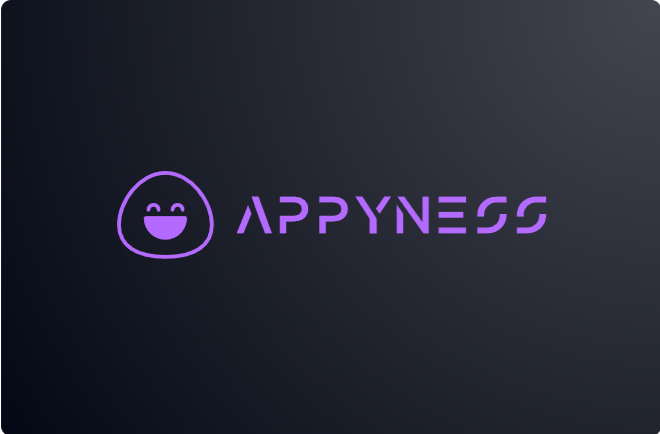

[](https://github.com/Vpkhubs/makeAPPY)

# 🔥 APPYness: Vaporwave AI Development Platform
## *"Developing Joy"* 🌌✨

**APPYness** is the most advanced free AI-powered development platform featuring **45+ AI models**, **o1-level reasoning**, and a **stunning vaporwave aesthetic**. Build full-stack applications with bleeding-edge AI while enjoying matrix rain effects, neon glows, and retro-futuristic vibes.

## 🚨 **BREAKING: DeepSeek R1 Integration!**

We've integrated **DeepSeek R1** - the revolutionary AI model that matches **OpenAI o1 performance** at **1/20th the cost**! Experience o1-level reasoning for just **$0.55** per million tokens (vs OpenAI's $15).

## 🎭 **What Makes APPYness Revolutionary**

### **🔥 45+ AI Models at Your Fingertips**
- **DeepSeek R1** - o1-level reasoning at fraction of cost
- **Free models** from Groq, Hugging Face, Together AI
- **Local models** via Ollama (100% private)
- **Premium models** from OpenAI, Anthropic, Google
- **Real-time model switching** with sleek dropdown

### **🌌 Vaporwave Aesthetic Experience**
- **Matrix rain effects** cascading down your screen
- **Neon glows** and **scanline overlays**
- **Retro-futuristic UI** with cyberpunk vibes
- **Gigantic glowing logo** that pulses with energy
- **Dark haunted atmosphere** with maximalist design

### **🚀 Full-Stack Development Power**
- **Complete browser-based IDE** powered by WebContainers
- **Install and run** any npm packages
- **Node.js servers** running in browser
- **Real-time preview** with hot reload
- **Deploy to production** directly from chat

## 🎮 **Available AI Models**

### **🆓 FREE Models (30+)**

#### **🔥 DeepSeek (Game Changer)**
- `deepseek-r1` - o1-level reasoning at 1/20th cost
- `deepseek-r1-distill-qwen-32b` - Distilled reasoning
- `deepseek-r1-distill-llama-70b` - Powerful distilled

#### **⚡ Groq (Super Fast)**
- `groq-llama-3.3-70b` - Latest Llama model
- `groq-deepseek-r1-distill` - FREE reasoning!
- `groq-llama-3.1-8b/70b` - Lightning fast
- `groq-gemma2-9b` - Google's model

#### **🤗 Hugging Face**
- `hf-qwen3-32b` - Latest Qwen model
- `hf-llama3.3-70b` - Latest Llama
- `hf-deepseek-r1-distill` - FREE reasoning
- `hf-codellama` - Code specialist

#### **🤝 Together AI**
- `together-deepseek-r1-free` - FREE reasoning!
- `together-llama3.3-70b` - Latest Llama Turbo
- `together-qwen3-32b` - Latest Qwen Turbo

#### **🔍 Google Gemini**
- `google-gemini-2.0-flash` - Latest Gemini
- `google-gemini-1.5-flash/pro` - Fast & capable

#### **🏠 Ollama (100% Local & Private)**
- `ollama-llama3.3` - Latest local model
- `ollama-deepseek-r1` - Local reasoning
- `ollama-qwen2.5` - Private & fast

### **💰 Premium Models (15+)**

#### **🧠 OpenAI (Latest 2025)**
- `openai-o3` - Most advanced reasoning
- `openai-o4-mini` - Fast reasoning
- `openai-gpt-4.1` - Latest GPT series

#### **🤖 Anthropic Claude**
- `anthropic-claude-4-opus` - Most capable
- `anthropic-claude-4-sonnet` - High performance
- `anthropic-claude-3.7-sonnet` - Extended thinking

## 🛠️ **Quick Start**

### **Prerequisites**
- Node.js 18+ installed
- Git installed
- Modern web browser

### **Installation**
```bash
# Clone the repository
git clone https://github.com/Vpkhubs/makeAPPY.git
cd makeAPPY

# Install dependencies
npm install

# Set up environment variables
cp .env.example .env.local
# Add your API keys to .env.local

# Start the development server
npm run dev
```

### **🔑 API Keys Setup**
Get free API keys from these providers:

1. **DeepSeek** (Recommended): https://platform.deepseek.com/
2. **Groq** (Free & Fast): https://console.groq.com/
3. **Hugging Face** (Free): https://huggingface.co/settings/tokens
4. **Together AI** (Free): https://api.together.xyz/
5. **Google Gemini** (Free): https://aistudio.google.com/app/apikey

Add them to your `.env.local` file:
```bash
DEEPSEEK_API_KEY=your_deepseek_key_here
GROQ_API_KEY=your_groq_key_here
HUGGINGFACE_API_KEY=your_hf_key_here
# ... add other keys as needed
```

## 🎯 **Usage**

1. **Start the platform**: `npm run dev`
2. **Open browser**: Navigate to `http://localhost:5174`
3. **Select AI model**: Click the dropdown in the header
4. **Start building**: Type your prompt and watch the magic happen!

### **🌟 Example Prompts**
```
"Create a React app with a dark theme and particle background"

"Build a full-stack todo app with authentication and real-time updates"

"Design a 3D portfolio website with three.js animations"

"Create a vaporwave-themed landing page with neon effects"
```

## 🎨 **Vaporwave Features**

- **Matrix Rain**: Cascading green code effects
- **Neon Glows**: Purple and cyan lighting effects
- **Scanlines**: Retro CRT monitor simulation
- **Particle Systems**: Dynamic background animations
- **Cyberpunk UI**: Dark theme with neon accents
- **Pulsing Logo**: Animated APPYness branding

## 🔧 **Development**

### **Branch Structure**
- `main` - Stable production version
- `development` - Active development branch
- `experimental` - Experimental features

### **Contributing**
1. Fork the repository
2. Create a feature branch: `git checkout -b feature/amazing-feature`
3. Commit changes: `git commit -m 'Add amazing feature'`
4. Push to branch: `git push origin feature/amazing-feature`
5. Open a Pull Request

## 📊 **Model Comparison**

| Model | Cost (per 1M tokens) | Performance | Speed | Free |
|-------|---------------------|-------------|-------|------|
| DeepSeek R1 | $0.55 | o1-level | Fast | ❌ |
| Groq Llama 3.3 | FREE | High | Ultra Fast | ✅ |
| HF Qwen 3 | FREE | High | Fast | ✅ |
| Together R1 | FREE | o1-level | Fast | ✅ |
| OpenAI o3 | $10.00 | Highest | Medium | ❌ |

## 🌟 **Why Choose APPYness?**

- **💰 Cost Effective**: Access o1-level reasoning for 1/20th the cost
- **🎨 Beautiful UI**: Stunning vaporwave aesthetic
- **🚀 45+ Models**: Largest selection of AI models
- **🆓 Many Free Options**: Build without spending money
- **🔒 Privacy Options**: Local models via Ollama
- **⚡ Lightning Fast**: Groq integration for speed
- **🛠️ Full-Stack**: Complete development environment

## 📞 **Support & Community**

- **GitHub Issues**: [Report bugs or request features](https://github.com/Vpkhubs/makeAPPY/issues)
- **Discussions**: [Join the community](https://github.com/Vpkhubs/makeAPPY/discussions)
- **Email**: developer@appyness.dev

## 📄 **License**

This project is licensed under the MIT License - see the [LICENSE](LICENSE) file for details.

## 🙏 **Acknowledgments**

- Built on the foundation of [Bolt.new](https://bolt.new) by StackBlitz
- Powered by [WebContainers](https://webcontainers.io/)
- Inspired by the vaporwave aesthetic movement
- Special thanks to all AI model providers

---

**🔥 Ready to develop with joy? Start building with APPYness today!** 🌌✨

*"In the neon-lit future of development, APPYness is your cyberpunk companion."*
